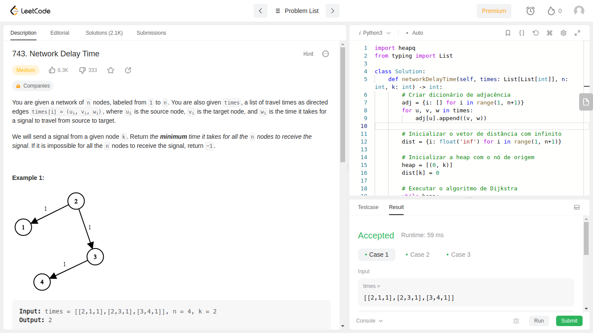
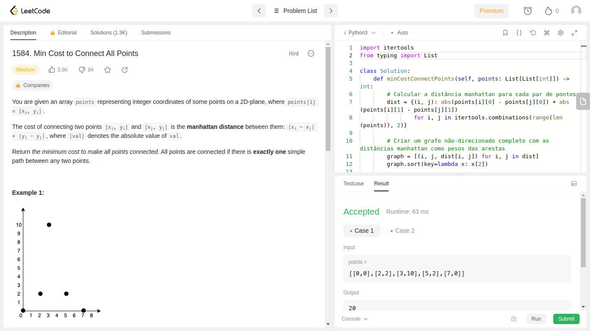
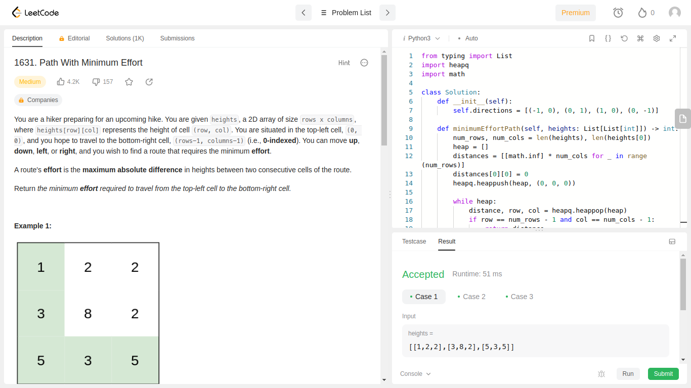
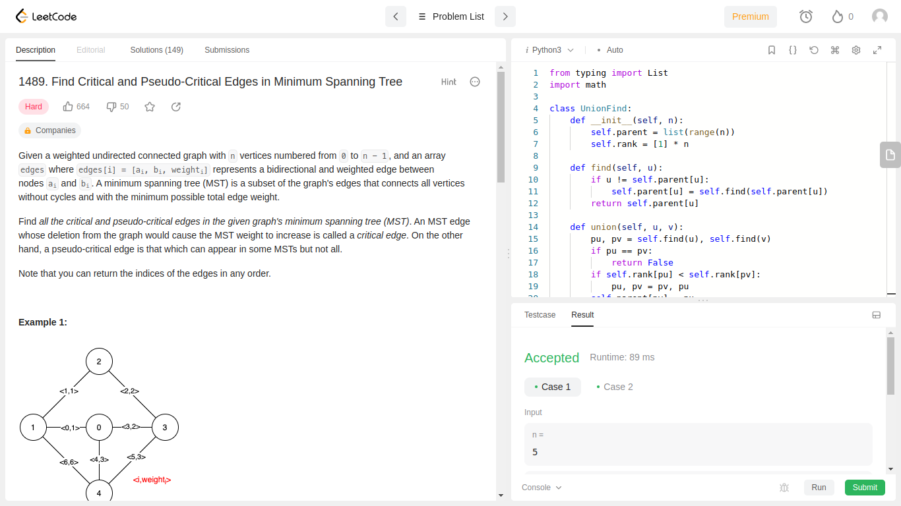

# Exercícios do LeetCode - Grafos 2

**Número da Lista**: 7 
**Conteúdo da Disciplina**: Grafos 2 

## Alunos
|Matrícula | Aluno |
| -- | -- |
| 20/2023903  | Lucas Lopes Rocha |
| 20/2023681  | Gabriel da Silva Rosa |

## Sobre 
Este projeto se trata da resolução de 4 exercícios abordando o tema de Grafos. Os exercícios foram retirados do site [LeetCode](https://leetcode.com/tag/graph/).

### Exercício 1
**Nome:** Tempo de Atraso da Rede 
**Código:** [ACESSO](exercicios/tempoAtraso/) 
**Página LeetCode:** [ACESSO](https://leetcode.com/problems/network-delay-time/) 

### Exercício 2
**Nome:** Custo Mínimo para Conectar Todos os Pontos 
**Código:** [ACESSO](exercicios/custoMinimo/) 
**Página LeetCode:** [ACESSO](https://leetcode.com/problems/min-cost-to-connect-all-points/description/) 

### Exercício 3
**Nome:** Caminho com Esforço Mínimo 
**Código:** [ACESSO](exercicios/CaminhoComEsforcoMinimo/) 
**Página LeetCode:** [ACESSO](https://leetcode.com/problems/path-with-minimum-effort/) 

### Exercício 4
**Nome:** Encontrar as arestas críticas e pseudo-críticas na Árvore Geradora Mínima 
**Código:** [ACESSO](exercicios/EncontrarArestasCr%C3%ADticasePseudoCriticas/) 
**Página LeetCode:** [ACESSO](https://leetcode.com/problems/find-critical-and-pseudo-critical-edges-in-minimum-spanning-tree/description/) 

## Screenshots

## Instalação 
**Linguagem**: Python3 
- **OBS.:** Não será necessária nenhuma instalação pois os códigos serão executados no próprio site do LeetCode.

## Uso 

### Passo 1: Copiar o código
Entre na pasta do exercício específico, clique no arquivo `.py` onde está armazenado o código e copie-o.

### Passo 2: Entrar na página do exercício
Entre na página LeetCode do exercício específico para que o código seja executado. O link para a página pode ser encontrado neste REEDME na sessão "Sobre" ou no título do REEDME da pasta do exercício.

### Passo 3: Alterar linguagem
Altere a linguagem utilizada como resolução para `Python3` (a opção fica logo acima do editor de código).

### Passo 4: Colar o código
Ainda na página do LeetCode, cole o código copiado no editor de código.

### Passo 5: Rodar o código
Abaixo do editor de código, clique em `Run` para executar o código.
- **OBS.:** É provável que seja necessário estar logado no site para executar esse passo.

### Passo 6: Verificar resultados
Assim que executado, verifique os resultados e se o código resolve o exercício.

### Repetir o processo
Repita o processo para cada um dos 4 exercícios resolvidos.

## Outros

**Vídeo da Apresentação (GitHub):** [ACESSO]()

**Vídeo da Apresentação (Youtube):** [ACESSO]()